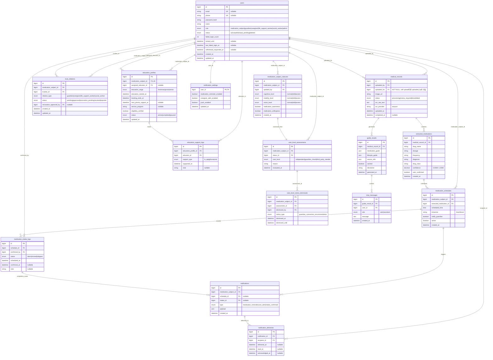

# 진료기록 기반 복약·생활습관 안내 시스템 ERD

> 기준: 요구사항 정의서 / API 명세서. 논리명은 설명용이며, 실제 DB·API 필드명은 모두 `snake_case`로 통일한다.

## 핵심 제약과 조회 규칙

- `medical_records.uploaded_for`는 항상 값이 있다. 본인 업로드는 `uploaded_by = uploaded_for`, 대리 업로드는 두 값이 다르다.
- 상태 등록과 평가는 한 트랜잭션이다. `medication_subject_statuses` 생성 직후 `care_level_assessments`를 생성하며, 최신 평가는 `evaluated_at DESC, id DESC`로 1건 조회한다.
- `extracted_medications.confidence < 0.80`이면 기록 상태를 `review_required`로 두고 사용자 확인 전 가이드를 확정하지 않는다.
- `third_party_needed` 상태에서 승인된 보호자·요양보호사 연결은 단독 즉시 해제하지 않고 `revocation_pending`과 제3자 승인 절차를 거친다.
- `third_party_needed`이면서 승인된 보호자·교육자가 없을 때만 연결 권유를 표시한다. `care_level_notice_dismissals.dismissed_until`까지 숨기며 서비스 자체는 차단하지 않는다.
- 가이드 재생성 시 기존 결과를 보존하고 새 `guide_results` 레코드를 생성하며, 최신 결과는 `generated_at DESC, id DESC`로 조회한다.
- 복약 완료는 `medication_intake_logs`, 알림 읽음·확인은 `notification_deliveries`에 분리해 저장한다. 한 사람이 복약 완료를 기록하면 다른 승인 수신자에게 `intake_confirmed` 알림을 생성한다.
- `third_party_needed`에서는 최소 한 명의 승인된 보호자·교육자에게 돌봄 알림이 유지되어야 하며, 이 규칙은 `notification_settings`보다 우선한다.
- 교육 단계는 `education_started_at` 기준 0~29일 `freshman`, 30~59일 `junior`, 60일 이후 `senior`로 계산한다. `tracking_ends_at`은 시작일로부터 60일이다.

## 요구사항 추적

| 요구사항 | 테이블/필드 | API |
|---|---|---|
| REQ-005~006 | `medication_subject_statuses`, `care_level_assessments.evaluated_at` | `POST /medication-subjects/{subject_id}/status`, `GET /medication-subjects/{subject_id}/care-level` |
| REQ-008~011 | `medical_records`, `extracted_medications.confidence` | `/medical-records*` |
| REQ-012~020 | `guide_results` | `GET /medical-records/{record_id}/guide*` |
| REQ-021~022 | `chat_messages.role`, `created_at` | `/chat*` |
| REQ-023~024 | `uploaded_by`, `uploaded_for`, `uploaded_at` | `GET /medical-records` |
| REQ-007a | `care_level_notice_dismissals.dismissed_until` | `/medication-subjects/{subject_id}/care-level-notice*` |
| REQ-026a~026d, REQ-036~038 | `medication_schedules`, `medication_intake_logs`, `notification_settings`, `notifications`, `notification_deliveries` | `/medication-schedules*`, `/medication-intakes*`, `/users/me/notification-settings`, `/notifications*`, `/monitoring*` |
| REQ-035 | `users.status`, `withdrawal_requested_at` | `DELETE /users/me`, `POST /users/me/withdrawal/cancel` |
| REQ-039 | `users.failed_login_count`, `locked_until` | `/auth/unlock/request`, `/auth/unlock/confirm` |
| REQ-040~043 | `education_profiles`, `education_support_logs`, `users.role` | `/medication-subjects/{subject_id}/education-*`, `/educators/me/medication-subjects` |
