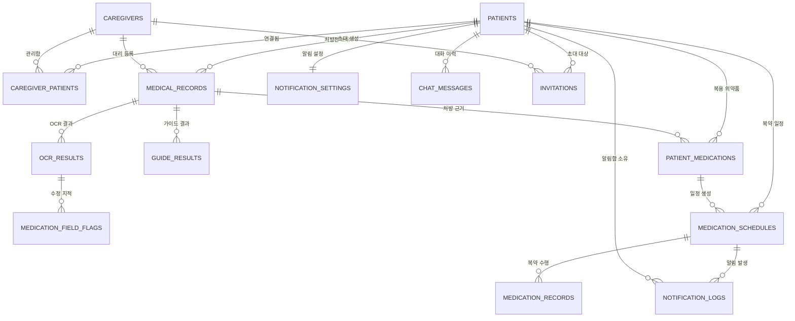

# ERD v12(final)

> 기준: `dev` 7f4fcd1과 PR #153의 `notification_logs.deleted_at` 설계
> 목적: 최종 데이터 모델의 테이블, 관계, 보존 규칙을 설명한다. 상세 컬럼은 같은 폴더의 `ERD_v12(final).dbml`을 기준으로 한다.

## 1. 용어와 계정 구조

- **복약관리 대상자**: 복약 일정, 처방전, 가이드의 주체이며 `patients`에 저장한다.
- **보호자·지원인력**: 개인 보호자, 생활지원사, 사회복지사 및 기관 계정을 포함하며 `caregivers`에 저장한다.
- **연결 관계**: 보호자·지원인력이 복약관리 대상자의 정보를 관리할 수 있는 권한이며 `caregiver_patients`에 저장한다.
- 이름과 전화번호는 암호화 컬럼에 저장하고, 전화번호 검색에는 별도 HMAC 해시를 사용한다.

## 2. 관계도

## 3. 테이블 사전

| 영역 | 테이블 | 역할 |
|---|---|---|
| 계정 | `patients` | 복약관리 대상자 계정, 식사 시간, 로그인 잠금, 탈퇴 예약 |
| 계정 | `caregivers` | 보호자·지원인력·기관 계정과 기관 정보 |
| 계정 | `refresh_tokens` | refresh token 회전·폐기 상태 |
| 계정 | `password_reset_codes` | 만료·시도 횟수가 있는 비밀번호 재설정 코드 |
| 계정 | `privacy_purge_audits` | 계정 탈퇴 요청, 취소, 삭제 완료 감사 기록 |
| 연결 | `caregiver_patients` | 계정 간 다대다 연결, 해제 상태, 관계별 알림 수신 설정 |
| 연결 | `invitations` | 전화번호 기반 연결 초대와 만료·수락 상태 |
| 연결 | `revocation_notices` | 연결·해제·승인 결과 알림 |
| 처방전 | `medical_records` | 처방전 사진 경로, 처리·검토·즐겨찾기·논리 삭제 상태 |
| 처방전 | `ocr_results` | OCR로 추출한 의약품·용법·진단 정보와 확인 상태 |
| 처방전 | `medication_field_flags` | 보호자·지원인력이 제안한 OCR 필드 수정 내용 |
| 처방전 | `record_correction_notices` | 처방전 수정 요청·완료 알림 |
| 가이드 | `guide_results` | 복약 주의사항, 생활습관 가이드, 출처 참조 |
| 가이드 | `guide_cache` | 진단명·의약품·데이터 버전 조합별 가이드 캐시 |
| 복약 | `patient_medications` | 현재 복용 의약품과 확인·논리 삭제 상태 |
| 복약 | `medication_schedules` | 복약 시각, 식사 관계, 반복 요일, 활성 상태 |
| 복약 | `medication_records` | 예정·복용·누락·건너뜀 등 실제 수행 기록 |
| 복약 | `medication_logs` | 이전 복약 기록과의 호환을 위해 유지되는 기록 |
| 알림 | `notification_settings` | 복약 알림, 돌봄 알림, 전체 Push 설정 |
| 알림 | `notification_logs` | 발생한 복약 알림과 확인·논리 삭제 상태 |
| 알림 | `push_subscriptions` | 계정과 브라우저별 Web Push 구독 |
| 알림 | `schedule_caregiver_alerts` | 일정별 보호자 알림 대상 |
| 챗봇 | `chat_messages` | 질문·답변과 최근 처방전 기준 대화 이력 |
| 감사 | `audit_logs` | 주요 정보 변경 전후 값과 변경 수행자 |

## 4. 핵심 관계와 제약

1. `caregiver_patients`는 `caregiver_id`와 `patient_id`로 계정을 연결한다. 활성 관계만 접근 권한으로 인정한다.
2. `notification_settings`는 `patient_id`를 기본키이자 외래키로 사용해 복약관리 대상자와 1:1 관계를 가진다. `caregiver_patients.notifications_enabled`는 관계별 기기 수신 여부이므로 두 설정의 목적이 다르다.
3. `medical_records.patient_id`가 처방전 소유자를 결정한다. 보호자·지원인력이 등록한 경우 `uploaded_by_caregiver_id`도 기록한다.
4. 처방전 삭제는 `medical_records.deleted_at`을 설정하고 연결된 `patient_medications`를 논리 삭제하며 관련 일정을 비활성화한다.
5. `notification_logs`는 `(schedule_id, due_date, time_slot, kind)` 조합을 유일하게 유지해 같은 복약 알림의 중복 적재를 방지한다.
6. 알림함에서 삭제하면 `notification_logs.deleted_at`을 설정한다. 해당 행은 목록·확인·후속 삭제 대상에서 제외되지만 감사와 장애 분석을 위해 보존한다.
7. `guide_cache.cache_key`는 정규화한 진단명, 정렬한 의약품명, 데이터 버전으로 생성한다. `expires_at` 이전에 같은 요청이 들어오면 저장 결과를 재사용한다.
8. `push_subscriptions`는 `(recipient_role, recipient_id, endpoint)` 조합을 유일하게 유지한다.
9. 다형 참조인 `recipient_role/recipient_id`, `subject_type/subject_id`는 데이터베이스 외래키 대신 애플리케이션의 인가·유효성 검증을 사용한다.
10. `audit_logs.before`와 `audit_logs.after`에는 이름·전화번호 같은 개인 식별 값을 마스킹해 기록한다.

## 5. 삭제와 보존 기준

| 데이터 | 처리 | 일반 조회 |
|---|---|---|
| 처방전 | `medical_records.deleted_at` 설정 | 제외 |
| 복용 의약품 | `patient_medications.deleted_at` 설정 | 제외 |
| 알림함 기록 | `notification_logs.deleted_at` 설정 | 제외 |
| 대기 중 초대 | `invitations.status='cancelled'` | 수락 불가 |
| 계정 | 즉시 비활성화 후 30일 뒤 개인정보 삭제 | 로그인·업무 접근 차단 |

물리 삭제와 논리 삭제를 혼용하지 않도록 API 설명, 요구사항 정의서, DB 컬럼 설명에서 모두 **논리 삭제**라는 용어를 사용한다.
