# 진료기록 기반 복약·생활습관 안내 시스템 ERD

> 기준: `backend/models.py`(SQLModel) 실제 구현 + `backend/alembic/versions/` 전체 마이그레이션 체인(head: `46e60aff6632`, `uv run alembic heads`로 2026-07-30 재확인 — 단일 head, 분기 없음) / 팀 공유 개발 환경은 **MySQL**(Aiven, `DATABASE_URL`), 로컬 개인 개발은 **SQLite**(`backend/app.db`). 논리명은 설명용이며, 실제 DB·API 필드명은 모두 `snake_case`로 통일한다.
>
> 최종 버전: v12(final) (2026-08-03). v11 대비 변경 내역은 `docs/revision_logs/ERD/ERD_v11_to_v12_revision_log.md`에서만 관리한다. dbdiagram.io에 바로 붙여넣을 수 있는 DBML은 `ERD/ERD_v12(final).dbml` 참고.
>
> **v12는 v11(2026-07-28, 커밋 `15a23f6`) 이후 dev에 머지된 100개 커밋을 반영한다.** 신규 테이블은 없다(24개 유지). `caregiver_patients` 테이블에 `notifications_enabled` 컬럼 1개가 추가됐다(마이그레이션 `46e60aff6632`, 부모 `48230e8ff2b4` — v11 이후 순수 신규 마이그레이션 정확히 1개, 전체 마이그레이션 파일 37개). 그 외 테이블·컬럼·타입·제약 변경은 없다(models.py 전체 diff + alembic 신규 마이그레이션 diff 양쪽으로 교차 확인 완료). 아울러 v11 mermaid 블록 자체의 기존 누락 1건(`invitations.invited_phone_hash`, v11 작성 시점 이전인 2026-07-22 추가 필드가 빠져 있었음)을 이번에 같이 보정한다.

```mermaid
erDiagram
    caregivers ||--o{ caregiver_patients : "caregiver_id"
    patients ||--o{ caregiver_patients : "patient_id"
    patients ||--o{ medical_records : "patient_id"
    caregivers ||--o{ medical_records : "uploaded_by_caregiver_id (nullable)"
    medical_records ||--o{ ocr_results : "record_id"
    medical_records ||--o{ guide_results : "record_id"
    medical_records ||--o{ medication_schedules : "record_id (nullable)"
    patients ||--o{ medication_schedules : "patient_id"
    patient_medications ||--o{ medication_schedules : "patient_medication_id (nullable)"
    medication_schedules ||--o{ medication_logs : "schedule_id"
    caregivers ||--o{ medication_logs : "confirmed_by_caregiver_id (nullable)"
    medication_schedules ||--o{ notification_logs : "schedule_id"
    patients ||--o{ notification_logs : "patient_id"
    patients ||--o{ patient_medications : "patient_id"
    medical_records ||--o{ patient_medications : "prescription_id (nullable)"
    patient_medications ||--o{ medication_records : "patient_medication_id (nullable)"
    medication_schedules ||--o{ medication_records : "schedule_id (nullable)"
    caregivers ||--o{ medication_records : "confirmed_by_caregiver_id (nullable)"
    patients ||--o{ invitations : "patient_id (nullable)"
    caregivers ||--o{ invitations : "inviter_caregiver_id (nullable)"
    patients ||--|| notification_settings : "patient_id (PK 겸 FK, 1:1)"
    patients ||--o{ chat_messages : "patient_id"
    ocr_results ||--o{ medication_field_flags : "ocr_result_id"
    medical_records ||--o{ record_correction_notices : "record_id"
    medication_schedules ||--o{ schedule_caregiver_alerts : "schedule_id"
    caregivers ||--o{ schedule_caregiver_alerts : "caregiver_id"

    patients {
        int id PK
        string name_encrypted "Fernet 암호화, .name 프로퍼티로 투명 암복호화"
        string note "nullable, 자유 텍스트(예: 치매 초기)"
        string phone_encrypted "nullable, Fernet 암호화"
        string phone_hash "nullable, indexed, HMAC-SHA256 (조회 전용, 복호화 불가)"
        string email "nullable, unique"
        string birth_date "nullable, 자유 텍스트"
        string hashed_password "nullable, bcrypt"
        bool push_enabled "default true"
        bool sms_enabled "default false"
        bool email_opt_in "default false"
        datetime created_at
        int failed_login_attempts "default 0, REQ-039"
        datetime locked_at "nullable, REQ-039(5회 실패 시 기록, 30분 후 자동 해제)"
        datetime deactivated_at "nullable, REQ-035(탈퇴 요청 시각)"
        datetime deletion_scheduled_at "nullable, REQ-035(탈퇴+30일)"
        string breakfast_time "nullable, 자가진단 식사시간(HH:MM 자유 텍스트)"
        bool breakfast_regular "nullable, 아침 식사 규칙적 여부"
        string lunch_time "nullable"
        bool lunch_regular "nullable"
        string dinner_time "nullable"
        bool dinner_regular "nullable"
        datetime caregiver_alert_dismissed_at "nullable, REQ-007a(연결 권유 안내 닫음, 30일 재표시 억제)"
        string gender "nullable, [v11 신규] 'male'/'female' — 평문(PII 암호화 대상 아님, 코드 주석에 '추후 재검토' 명시)"
    }
    caregivers {
        int id PK
        string name_encrypted "Fernet 암호화, .name 프로퍼티"
        string email "nullable, indexed — [v11 변경] unique 제약 제거, 앱 레벨에서 relation_type끼리만 중복 검사(같은 사람이 guardian+organization 계정을 함께 가질 수 있게)"
        string hashed_password "nullable, bcrypt"
        string relation_type "guardian/caregiver/life_support_worker/social_worker/organization"
        string phone_encrypted "nullable, Fernet 암호화"
        string phone_hash "nullable, indexed, HMAC-SHA256"
        string birth_date "nullable"
        bool push_enabled "default true"
        bool sms_enabled "default false"
        bool email_opt_in "default false"
        string org_name "nullable, relation_type=organization일 때만"
        string org_type "nullable, 프론트(SignUp.tsx)는 요양원/정부기관/협회/보건소/기타 5개 값만 선택 가능"
        string business_reg_no "nullable"
        string manager_name "nullable, 암호화 대상 아님(계정 본인 PII 아님)"
        string manager_phone "nullable, 암호화 대상 아님"
        datetime created_at
        int failed_login_attempts "default 0, REQ-039"
        datetime locked_at "nullable"
        datetime deactivated_at "nullable, REQ-035"
        datetime deletion_scheduled_at "nullable, REQ-035"
    }
    caregiver_patients {
        int id PK
        int caregiver_id FK
        int patient_id FK
        datetime created_at
        string status "default active — active/revocation_pending/revoked (REQ-004, REQ-066). [v11] 분기 기준이 care_level에서 '요청자가 organization 계정인가'로 변경 — organization의 해제만 사유+승인 필요, 그 외는 즉시 처리"
        datetime revoked_at "nullable"
        int revocation_requested_by "nullable, FK 없음(caregivers.id 또는 patients.id 중 하나, 앱 레벨 검증)"
        string requested_by_role "nullable, 'caregiver'|'patient' — 자기승인 방지 가드용"
        string revocation_reason "nullable, [v11 신규, REQ-066] organization 계정이 해제 요청 시 필수 입력하는 사유"
        datetime revocation_requested_at "nullable, [v11 신규] 14일(REVOCATION_TIMEOUT_DAYS) 무응답 자동확정 기준시각"
        bool notifications_enabled "default true, (보호자, 환자) 관계 단위 알림 on/off — notification_settings(환자 단위, 전체 공유)과 별개"
    }
    password_reset_codes {
        int id PK
        string subject_type "patient/caregiver"
        int subject_id "indexed, FK 없음(다형 참조)"
        string code_hash "indexed, HMAC 해시(원문 미저장)"
        datetime expires_at "발급+10분"
        datetime used_at "nullable"
        int attempts "default 0, 5회 초과 시 코드 무효화"
        datetime created_at
    }
    privacy_purge_audits {
        int id PK
        string subject_type "patient/caregiver"
        int subject_id "indexed"
        datetime requested_at
        datetime deactivated_at
        datetime scheduled_purge_at "requested_at + 30일"
        string status "default pending — pending/completed/cancelled"
        datetime completed_at "nullable"
    }
    medical_records {
        int id PK
        int patient_id FK
        string image_path "[v11] 이제 폐기되지 않고 실제로 저장됨(uploads/prescriptions/{uuid4}.ext) — REQ-064"
        string status "processing/review_required/completed/failed"
        string raw_text "nullable, TEXT"
        string failure_reason "nullable"
        datetime created_at
        int uploaded_by_caregiver_id FK "nullable, 대리 업로드일 때만"
        datetime deleted_at "nullable, 소프트 삭제(등록내역 삭제)"
        bool pinned "default false, [v11 신규, REQ-074] 즐겨찾기"
        string prescription_date "nullable, [v11 신규] OCR 원문에서 추출한 처방일자 — 재처방 시 기존 일정 대체 판단 기준"
        string caregiver_review_status "default none, [v11 신규, REQ-063] none/pending/needs_correction/reviewed"
    }
    ocr_results {
        int id PK
        int record_id FK
        string drug_name
        string drug_code "default ''"
        string dosage "default '', 1회 사용량(정/캡슐 등 단위 수량)"
        string dose_amount "default '', [v11 신규] 1회 투여량(mg/ml 등 함량) — dosage와 별개"
        string frequency "default ''"
        string total_days "default '', 총 투약일수"
        string diagnosis "default ''"
        string drug_class "default ''"
        float confidence "default 0.0"
        bool review_required "default false"
        bool user_confirmed "default false"
        string matched_drug_name "default '', drug_matcher 결과"
        float match_score "default 0.0"
        bool needs_review "default false, match_score<0.7"
    }
    guide_results {
        int id PK
        int record_id FK
        string medication_guide "TEXT, JSON 문자열"
        string lifestyle_guide "TEXT, JSON 문자열"
        string source_refs "default '[]', TEXT, JSON 문자열"
        datetime created_at
    }
    medication_schedules {
        int id PK
        int patient_id FK
        string drug_name
        string time_slot "08:00 같은 실제 시각 문자열"
        string dose_timing "nullable, 공복/식전/식후 등"
        bool caregiver_alert "default true"
        string memo "nullable"
        bool active "default true"
        datetime created_at
        int patient_medication_id FK "nullable, indexed — OCR 자동생성 일정은 PatientMedication이 없음"
        string meal_relation "nullable"
        string instructions "nullable"
        string timezone "nullable"
        string days_of_week "nullable, JSON 배열 문자열"
        int record_id FK "nullable, indexed — 이 일정을 만든 처방전(등록내역 삭제 시 cascade 비활성화용)"
    }
    medication_logs {
        int id PK
        int schedule_id FK
        string status "default taken — taken/skipped만 존재(missed 없음)"
        datetime checked_at
        string note "nullable"
        string confirmed_by_type "default patient — patient/caregiver"
        int confirmed_by_caregiver_id FK "nullable"
    }
    notification_logs {
        int id PK
        int schedule_id FK "indexed"
        int patient_id FK "indexed"
        string due_date "indexed, YYYY-MM-DD"
        string time_slot
        string kind "default reminder — reminder/missed"
        string status "default pending — pending/sent/suppressed/failed"
        string channels "default '[]', JSON 배열"
        datetime fired_at
        datetime acknowledged_at "nullable"
    }
    patient_medications {
        int id PK
        int patient_id FK "indexed"
        int drug_id "nullable, indexed, FK 없음(마스터 약물 테이블 아직 없음)"
        string item_seq "nullable, indexed"
        string product_code "nullable"
        string medication_name "필수"
        string manufacturer_name "nullable"
        string dosage_amount "nullable"
        string dosage_unit "nullable"
        int frequency_per_day "nullable"
        string administration_route "nullable"
        string start_date "nullable"
        string end_date "nullable"
        int prescription_id FK "nullable, medical_records.id"
        string source_type "default manual — manual/prescription_ocr/pill_image/api_search"
        string source_raw_text "nullable"
        string verification_status "default unverified — unverified/matched/user_confirmed/pharmacist_confirmed"
        bool is_active "default true"
        datetime created_at
        datetime updated_at
        datetime deleted_at "nullable, 소프트 삭제"
    }
    medication_records {
        int id PK
        int patient_medication_id FK "nullable — OCR 기반 스케줄은 PatientMedication이 없음"
        int schedule_id FK "nullable"
        datetime scheduled_at "nullable"
        datetime taken_at "nullable, 실제 복용 시간"
        string status "default scheduled — scheduled/taken/missed/skipped/duplicate_suspected"
        string verification_method "default self_report — self_report/caregiver/photo/device"
        string evidence_image_url "nullable"
        string memo "nullable"
        string confirmed_by_type "nullable, patient/caregiver — medication_logs와 동일 필드명"
        int confirmed_by_caregiver_id FK "nullable"
        datetime created_at
        datetime updated_at
    }
    invitations {
        int id PK
        int patient_id FK "nullable — 보호자→환자 초대(relation_type=patient)는 수락 전까지 환자 계정 자체가 없음"
        int inviter_caregiver_id FK "nullable"
        string relation_type "default guardian — guardian/caregiver/life_support_worker/social_worker/patient"
        string invited_phone_encrypted "nullable, Fernet 암호화(v8까지는 평문이었으나 2026-07-15 보안 리뷰로 암호화 전환)"
        string invited_phone_hash "nullable, indexed — 조회용 HMAC 해시(2026-07-22 추가, invited_phone_encrypted는 Fernet이라 WHERE 조회 불가) — 로그인한 보호자/기관이 자기 전화번호로 '받은 초대' 목록을 찾을 때 사용"
        string token_hash "unique, indexed — v8까지는 원문 token이었으나 2026-07-15 보안 리뷰로 해시 전환"
        string status "pending/accepted/rejected/expired/cancelled"
        datetime created_at
        datetime accepted_at "nullable"
        datetime expires_at "nullable — v8까지 없었음, 2026-07-15 추가(발급+7일)"
    }
    refresh_tokens {
        string jti PK "JWT ID 자체가 PK(자동증가 id 없음)"
        int subject_id
        string role
        bool revoked "default false"
        datetime expires_at
        datetime created_at
    }
    notification_settings {
        int patient_id PK,FK "1:1, patients와 동일 PK 공유"
        bool medication_reminder_enabled "default true"
        bool care_alert_enabled "default true"
        bool all_push_enabled "default true"
        string chatbot_name "default '약콩이'"
        datetime updated_at
    }
    chat_messages {
        int id PK
        int patient_id FK
        string question_id "고정 질문 식별자(q1/q2/q3, 동적 질문 dyn:*) 또는 freeform"
        string question_text
        string answer_text
        datetime created_at
    }
    guide_cache {
        int id PK
        string cache_key "unique, indexed — SHA-256(sorted 진단명 + sorted 약물조합 + data_version)"
        string diagnosis "nullable"
        string drug_names "default '[]', TEXT, JSON 배열"
        string data_version "GUIDE_DATA_VERSION 환경변수, [v11] v1.1→v1.2로 상향(lifestyle_guide 스키마 변경으로 옛 캐시 무효화)"
        string guide_result "TEXT, medication_guide/lifestyle_guide/source_refs 튜플의 JSON 직렬화. [v11] lifestyle_guide 내부 구조가 자유 텍스트에서 diet/exercise/other × recommended/avoid로 변경"
        datetime created_at
        datetime expires_at "created_at + GUIDE_CACHE_TTL_DAYS(기본 7일)"
    }
    revocation_notices {
        int id PK
        string recipient_role "[v11 신규, REQ-066/067] caregiver/patient"
        int recipient_id "FK 없음(다형 참조, password_reset_codes와 동일 패턴)"
        int patient_id "FK 없음(표시용 스냅샷)"
        string patient_name
        string counterpart_name
        string event "linked/unlinked/revocation_approved/revocation_rejected — 마이그레이션 이력: 최초엔 revocation 전용 bool형 approved 컬럼이었다가 이벤트 기반으로 일반화하며 대체(다운그레이드 시 정보 손실 있음, 의도적)"
        string reason "nullable"
        datetime created_at
        datetime read_at "nullable"
    }
    record_correction_notices {
        int id PK
        string recipient_role "patient/caregiver"
        int recipient_id "FK 없음(다형 참조)"
        int record_id FK
        string event "correction_requested/correction_completed"
        datetime created_at
        datetime read_at "nullable"
    }
    medication_field_flags {
        int id PK
        int ocr_result_id FK
        string field_name "drug_name/dosage/dose_amount/frequency/total_days/diagnosis/drug_class 중 하나"
        string reason
        string suggested_value "보호자·기관이 제안한 값 — 환자는 이 값 그대로만 반영 가능(자유 입력 불가)"
        bool corrected "default false"
        datetime created_at
        datetime corrected_at "nullable"
    }
    push_subscriptions {
        int id PK
        string recipient_role "caregiver/patient"
        int recipient_id "FK 없음(다형 참조)"
        string endpoint "VARCHAR(512)"
        string p256dh
        string auth
        datetime created_at
    }
    schedule_caregiver_alerts {
        int id PK
        int schedule_id FK
        int caregiver_id FK
    }
    audit_logs {
        int id PK
        string table_name "indexed"
        int record_id "indexed, FK 없음(대상 테이블이 여러 개)"
        int actor_id
        string actor_role
        string action "default update"
        string before "nullable, TEXT(JSON) — name/phone 등 PII는 평문 대신 '***'로 마스킹"
        string after "nullable, TEXT(JSON), 동일 마스킹"
        datetime created_at
    }
```

## 핵심 제약과 조회 규칙 (v12, 실제 구현 기준)

- `patients`/`caregivers`의 `name`/`phone`은 저장은 암호화(`name_encrypted`/`phone_encrypted`)로, 조회는 `.name`/`.phone` 파이썬 프로퍼티가 투명하게 복호화한다 — 생성자 kwarg로는 못 받고(`Patient(**kwargs)` 후 `patient.name = ...` 2단계 생성 필수), 응답 시엔 항상 평문으로 나간다.
- `phone_hash`는 정규화한 전화번호의 HMAC-SHA256이며 로그인 시 `WHERE phone_hash = ?` 조회 전용이다.
- `caregivers.manager_name`/`manager_phone`은 여전히 암호화 대상이 아니다(계정 본인 PII 아님이라는 이유, v8에서 이미 지적됨, 변경 없음).
- **[v9 반영] `invitations.invited_phone`이 이제 암호화된다.** v8 시점엔 평문 저장·응답이 PII 정책 사각지대였으나, 2026-07-15 보안 리뷰(REQ-030/002)에서 `invited_phone_encrypted`로 전환했다. `invitations` 목록 조회 응답(`GET /patients/{patient_id}/invitations`)에서도 이제 복호화된 값만 노출되고, **`token`도 더 이상 원문으로 저장·응답되지 않는다**(`token_hash`만 저장, 발급 시점에 한 번만 평문을 응답하고 이후엔 절대 복원 불가) — v8에서 지적됐던 "보안 주의" 2건이 모두 해소됐다.
- **`invitations.invited_phone_hash`**: `invited_phone_encrypted`(Fernet)는 암호화할 때마다 값이 달라져 `WHERE`로 조회할 수 없어, 로그인한 보호자/기관이 자기 전화번호로 "받은 초대" 목록을 찾을 수 있도록 `Patient`/`Caregiver.phone_hash`와 동일한 패턴의 조회 전용 HMAC 해시를 별도로 둔다. 이 필드는 2026-07-22(마이그레이션 `3a098c58f9f2`)에 이미 코드·마이그레이션 양쪽에 존재했으나 v11의 mermaid `invitations` 필드 블록에는 반영이 안 돼 있었다 — v11 이후 새로 생긴 변경이 아니라 v11 작성 당시의 단순 누락이며, v12에서 뒤늦게 보정한다.
- `caregiver_patients`는 다대다 연결이다. `POST /monitoring/caregivers/{cid}/patients/{pid}`(직접 연결)는 그 `patient_id`에 기존 연결이 하나도 없을 때만 허용한다(방금 만든 환자의 최초 연결 전용) — 이미 다른 보호자가 연결된 환자에 추가로 연결하려면 반드시 `invitations`의 토큰 기반 수락을 거쳐야 한다(v8부터 동일, 변경 없음).
- **[v9 신규, 정정] 보호자→환자 초대(REQ-058, 이전 초안은 REQ-037로 오기재 — REQ-037은 복약 여부 기록을 가리키는 별개 번호이며 요구사항_정의서_v9에 REQ-058을 신설해 정정)**: `invitations.relation_type="patient"`이면 초대 생성 시점엔 실제 환자 계정이 없어 `patient_id`가 `NULL`이다. 수락(`accept_invitation`) 시 `_register_patient()`(회원가입과 동일 로직 재사용)로 실제 로그인 가능한 `Patient` 행을 새로 만들고 그 `id`를 `invitations.patient_id`에 채운 뒤 `caregiver_patients` 연결을 생성한다. 기존 4-role(환자→보호자류) 초대 흐름은 변경 없이 그대로 동작한다.
- **돌봄관계 해제 워크플로(REQ-004/066)**: `caregiver_patients.status`가 `active`일 때 `DELETE /monitoring/caregivers/{cid}/patients/{pid}`를 호출하면(**[v11] 이전엔 `DELETE /trust/relations/{trust_id}`가 이 역할을 했으나, 자가진단 폐기로 `care_level` 기반 분기 자체가 무의미해져 이 엔드포인트로 흡수·재설계됐다**), 요청자가 `organization` 계정이면 `reason`을 받아 `revocation_pending`으로, 그 외(개인 보호자/지원인력/환자)는 즉시 `revoked`로 전환한다. `revocation_pending`은 `POST .../revocation-approval`로 다른 관계자가 승인(`revoked`)·거부(`active`로 복귀)할 수 있고, 원칙적으로 요청자 본인은 자기 요청을 승인할 수 없다(자기승인 방지 가드) — **[v11]** 단 요청 후 14일(`REVOCATION_TIMEOUT_DAYS`) 무응답이면 요청자 본인이 승인해 자동확정할 수 있다. 승인/거부 결과와 연결/해제 자체는 `revocation_notices`로 상대방에게 알림이 간다(REQ-067).
- **환자별 알림 on/off(PR 커밋 `24dbb8f` "알림을 환자별로 켜고 끄게 변경, 알림 관리 페이지 추가")**: `caregiver_patients.notifications_enabled`(기본 `true`)로 (보호자, 환자) 관계 단위 push 알림을 개별로 끌 수 있다. 여러 환자를 관리하는 보호자·기관이 "이 환자에 대한 알림만 이 기기로 안 받고 싶다"를 표현하는 용도로, 환자 단위로 전체 보호자가 공유하는 기존 `notification_settings`와는 층위가 다르다 — 예를 들어 보호자 A가 환자 甲에 대해서만 알림을 꺼도 같은 환자 甲에 연결된 보호자 B의 수신 여부나 `notification_settings.medication_reminder_enabled` 자체에는 영향이 없다. 마이그레이션은 기존 모든 관계 행을 `true`로 백필했다(이 기능이 생기기 전엔 다들 암묵적으로 알림을 받고 있었다는 전제).
- **[v9 신규] 보호자 연결 권유 억제(REQ-007a, PR #56)**: 활성 연결이 0명으로 떨어지면 `should_alert_now`가 true가 되어 연결 권유 안내를 표시한다. 사용자가 안내를 닫으면 `patients.caregiver_alert_dismissed_at`이 갱신되고, 이후 30일간(`dismissed_at + 30일`) 같은 환자에게는 이 안내가 다시 표시되지 않는다.
- `ocr_results.confidence`와 무관하게 `medical_records.status`는 항상 `review_required`로 시작한다. 보호자가 `POST /records/{id}/confirm`으로 확정해야 `completed`로 전환되고 그 시점에 `guide_results`가 생성된다(v8과 동일, 변경 없음).
- **[v9 신규] 가이드 캐싱(REQ-020, PR #60)**: `guide_cache.cache_key`(진단명+정규화된 약물조합+`GUIDE_DATA_VERSION` 기반 SHA-256)로 조회해 `expires_at`(기본 발급+7일) 이전이면 캐시를 그대로 재사용하고 LLM을 호출하지 않는다. `RAG_PROVIDER≠real`(stub 모드)일 때는 가짜 데이터가 캐시를 오염시키지 않도록 캐시 저장 자체를 하지 않는다.
- `guide_results`에는 여전히 `disclaimer` 컬럼이 없다. RAG 파이프라인(`rag/rag_chain.py`)의 `GuideResponse`는 `disclaimer` 필드를 생성하지만 `backend/routers/rag_router.py`가 이를 추출하지 않아 API 응답·DB 저장 어디에도 남지 않는다 — 실제 고지 문구는 프론트엔드(`Result.tsx`/`Dashboard.tsx`/`Processing.tsx`) 하드코딩이다(v8과 동일한 상태, REQ-032는 "부분"으로 유지).
- **[v9 신규] 로그인 잠금·비밀번호 재설정(REQ-039)**: `patients`/`caregivers` 양쪽에 `failed_login_attempts`/`locked_at`이 추가됐다. 5회 연속 로그인 실패 시 `locked_at`이 기록되고, `password_reset_codes`(HMAC 해시로 코드 저장, 10분 만료, 5회 시도 제한)를 통해 인증 후 새 비밀번호로 로그인하면 잠금·실패횟수가 초기화된다. 잠금 후 30분이 지나면 코드 없이도 자동 잠금 해제된다.
- **[v9 신규] 회원 탈퇴(REQ-035)**: `deactivated_at`/`deletion_scheduled_at`(탈퇴+30일)이 채워지고, `privacy_purge_audits`에 감사 레코드(`pending`)가 남는다. 30일 이내 `deactivated_at`/`deletion_scheduled_at`을 지우고 감사 레코드를 `cancelled`로 바꾸는 취소가 가능하다. **[v9 정정] 30일 후 영구 삭제 배치(purge)는 `backend/scripts/purge_expired_accounts.py`로 이미 구현·테스트돼 있다**(이전 v9 초안이 "실행 로직 확인 못함"이라 잘못 적었던 항목, 2026-07-21 재조사로 정정) — 단 서버 프로세스가 이 스크립트를 자동 트리거하지는 않으므로 수동 실행 또는 별도 cron 등록이 전제다.
- **[v9 신규] 자가진단 식사시간(회원가입 온보딩)**: `patients.breakfast_time`/`breakfast_regular`/`lunch_time`/`lunch_regular`/`dinner_time`/`dinner_regular` 6개 필드가 존재한다. 회원가입 직후 온보딩 화면에서 입력받으며, 저장은 되지만 **복약 가이드·생활습관 안내 생성 로직(`rag/rag_chain.py`)에서 이 값을 실제로 참조하는 코드는 확인되지 않았다** — "입력만 되고 활용은 안 되는" 상태로 REQ-051(신규, 요구사항_정의서 참고)에 "부분 구현"으로 명시한다.
- **[v9 신규] `medication_logs` vs `medication_records` 이원화 정리(REQ-037, PR #62)**: v8까지는 `medication_logs`(실사용, `taken`/`skipped`만)와 `medication_records`(프론트 어디서도 호출하지 않는 죽은 코드, `missed` 포함 5개 상태)가 공존했다. PR #62에서 `medication_records`를 유일한 실사용 테이블로 승격하고 과거 `medication_logs` 데이터를 이관했다 — 단 `medication_logs` 테이블 자체는 하위호환·롤백 안전을 위해 이번 버전에서 DROP하지 않고 남아 있다(1스프린트 관찰 후 별도 정리 예정). **현재 실제 체크인 응답 흐름은 `medication_records.status`(`scheduled`/`taken`/`missed`/`skipped`/`duplicate_suspected`) 기준이다.**
- `notification_settings.patient_id`는 PK이자 FK다(1:1). 설정을 조회했는데 행이 없으면 저장 없이 기본값 객체만 반환한다(v8과 동일).
- **[v10 신규] 대기중 초대 삭제**는 행 삭제가 아니라 `invitations.status="cancelled"`로 상태만 바꾼다. 이미 전달된 초대 링크가 뒤늦게 수락되는 것을 막기 위한 설계다.
- **[v10 신규] 처방전 등록내역 삭제**(`medical_records.deleted_at`) 시 `MedicationSchedule.record_id`로 연결된 일정뿐 아니라 `PatientMedication.prescription_id`로 연결된 내약도 soft delete하고, 해당 내약 기반 일정도 비활성화한다. DB FK cascade가 아니라 애플리케이션 레벨 동기화 규칙이다.
- `chat_messages.question_id`는 고정 질문(`q1`/`q2`/`q3`)뿐 아니라 환자가 등록한 약 이름 기반 동적 질문(`dyn:*`)과 자유 텍스트("freeform")도 구분하는 식별자다(v8 이후 동적 질문 기능 추가).
- **[v11 신규] 자가진단 완전 삭제**: `care_level_assessments` 테이블과 이를 채우던 API가 코드에서 실제로 제거됐다(v10까지는 "폐기 결정만 되고 API/테이블은 코드에 남아있는" 상태였음). REQ-005~007은 "보류"에서 "구현취소"로 재정정한다(요구사항_정의서_v11 참고).
- **[v11 신규] 보호자·기관 처방전 검토 흐름(REQ-063)**: `medical_records.caregiver_review_status`(none/pending/needs_correction/reviewed)로 상태를 관리하고, 지적 사항은 `medication_field_flags`(어떤 `ocr_results` 행의 어떤 필드인지 + 제안값)로, 검토 관련 알림은 `record_correction_notices`로 남긴다. 마이그레이션 `48230e8ff2b4`가 이 컬럼 도입 이전부터 있던 완료+보호자연결 레코드를 "pending"으로 소급 백필했다(신규 알림은 재발송 안 함).
- **[v11 신규] Push 구독 유니크 제약**: `push_subscriptions`는 `(recipient_role, recipient_id, endpoint)` 복합 유니크로 같은 기기 중복 구독을 막는다. `schedule_caregiver_alerts`는 `(schedule_id, caregiver_id)` 복합 유니크다.
- **[v11 신규] 감사로그(REQ-081, 최소 버전)**: `audit_logs`는 `PATCH /monitoring/patients/{id}`·`PATCH /monitoring/schedules/{id}` 변경분만 기록하는 write-only 로그다(조회 UI 없음). `before`/`after`의 `name`/`phone` 같은 PII는 값을 그대로 남기지 않고 `"***"`로 마스킹한다.
- **[v11] `caregivers.email`은 더 이상 테이블 전체 유니크가 아니다** — 같은 사람이 `guardian`(개인)과 `organization`(기관 소속) 계정을 같은 이메일로 각각 가질 수 있도록, 유니크 검사를 앱 레벨에서 `relation_type`끼리만 하도록 완화했다(회원가입/정보수정 라우터에서 `WHERE email=? AND relation_type=?`로 검사).

## 요구사항 추적 (v12, 실제 구현 기준 — 최종 구현 상태)

| 요구사항 | 테이블/필드 | API | 구현 | 비고 |
|---|---|---|---|---|
| REQ-001 | `caregivers`/`patients` | `POST /auth/login`, `POST /auth/token/refresh` | 완료 | 회원가입은 `/monitoring/patients`·`/monitoring/caregivers`가 겸함(`POST /auth/signup`은 2026-07-14 중복 코드로 제거됨) |
| REQ-002~004 | `invitations`, `caregiver_patients` | `/invitations*`, `/monitoring/caregivers/{cid}/patients/{pid}` | 완료 | REQ-004 해제 승인 워크플로가 `care_level` 기반에서 "요청자가 organization인가" 기반으로 재설계됨(REQ-066 참고, 이전 `/trust/relations/{id}` DELETE는 제거되고 위 엔드포인트로 흡수) |
| REQ-005~007 | (삭제됨) | (삭제됨) | 구현취소로 재정정(v10: 보류) | `POST /assessments`·`GET /assessments/latest`·`care_level_assessments` 테이블이 실제로 코드에서 삭제됐다 — v10까지는 "폐기 결정만 되고 코드는 남아있는" 상태였으나 이제 API/테이블 자체가 없다 |
| REQ-007a | `patients.caregiver_alert_dismissed_at` | `POST /trust/relations/{id}/dismiss-alert` | 완료 | |
| REQ-008~011 | `medical_records`, `ocr_results` | `/records*`, `/ocr/*` | 완료 | |
| REQ-012~020 | `guide_results`, `guide_cache` | `POST /records/{id}/confirm`(가이드 생성 포함) | 완료 | `lifestyle_guide` 구조가 diet/exercise/other × recommended/avoid로 변경(`GUIDE_DATA_VERSION` v1.2). TTS·재생성 전용 API는 여전히 미구현 |
| REQ-021~022 | `chat_messages` | `/chat/*` | 완료 | DUR 조회 결과도 `source_refs`에 포함되도록 수정(이전엔 DUR 답변만 출처가 항상 빈 배열이었음) |
| REQ-023~024 | `medical_records.uploaded_by_caregiver_id` | `GET /records` | 완료 | |
| REQ-026a | `medication_schedules`, `notification_logs` | `/monitoring/schedules*` | 부분 | 60초 주기 스케줄러 실체 확인됨. 실 발송 채널이 이메일+Push(백엔드만, REQ-068)로 확장됐으나 SMS는 여전히 미구현, Push는 프론트 구독 흐름이 없어 실질적으로 항상 0건 |
| REQ-026b | `notification_settings`, **`caregiver_patients.notifications_enabled`** | `/notification-settings` | 완료 | 환자 단위(`notification_settings`)에 더해 (보호자,환자) 관계 단위 on/off(`notifications_enabled`)가 추가됨 — 두 설정 다 켜져 있어야 실제 발송 대상이 된다(관계 단위 필터는 알림 관리 페이지 전용, 서버 측 발송 로직 반영 여부는 스케줄러 코드 별도 확인 필요) |
| REQ-026c | `patients.caregiver_alert_dismissed_at` | `POST /trust/relations/{id}/dismiss-alert` | 부분 | REQ-005~007 구현취소로 `third_party_needed` 개념 자체가 근거를 잃었다 — 이 REQ의 "제3자 도움 필요 시" 조건부는 더 이상 트리거될 방법이 없다 |
| REQ-026d | 없음 | - | 미구현 | |
| REQ-028 | 없음 | - | 측정 인프라 미구현 | |
| REQ-030 | PII 암호화 필드(Fernet/HMAC) | - | 부분 | 전송 구간 암호화는 배포 환경(HTTPS) 의존이라 미배포 상태에서는 검증 불가 |
| REQ-031 | `core/dependencies.py`(`get_current_actor` 등) | 전 라우터의 `Depends()` | 완료 | 2·6·8절(care/chat/monitoring) + 4·5절(records/ocr/rag) 전부 인가 적용 완료. 3절(자가진단)은 절 자체가 삭제됨 |
| REQ-032 | 없음(API 응답 필드 아님) | 모든 가이드·챗봇 응답의 `disclaimer` | 부분(프론트 하드코딩) | |
| REQ-035 | `deactivated_at`/`deletion_scheduled_at`/`privacy_purge_audits` | `POST /auth/withdraw`, `POST /auth/withdraw/cancel` | 완료 | 30일 유예 삭제 실행 배치는 `backend/scripts/purge_expired_accounts.py`로 구현·테스트됨(수동/cron 실행 전제) |
| REQ-036~038 | `medication_schedules`, `medication_records` | `/monitoring/schedules*`, `/monitoring/logs`, `/monitoring/today` | 완료 | `medication_records.status`에 `missed` 포함 + 확인자·예정/확인시각 전부 존재 |
| REQ-039 | `failed_login_attempts`/`locked_at`, `password_reset_codes` | `POST /auth/login`, `/auth/password-reset/*` | 완료 | |
| REQ-040~044 | 없음 | - | 구현취소(지원인력 교육지원/교육·추적관리 기능을 제품 범위에서 제외) | `education_profiles`, `education_support_logs` 테이블과 API를 만들지 않음 |
| REQ-045 | `patients`/`caregivers`(`birth_date`) | `POST /monitoring/patients`, `POST /monitoring/caregivers` | 부분(`birth_date`만, `address` 없음) | |
| REQ-046 | 없음(가입과 초대가 별개 절차) | - | 미구현 | |
| REQ-047 | `ocr_results.match_score` | `PATCH /records/{id}/medications/{id}` | 완료 | `typo_suggestion` 응답 필드 |
| REQ-048 | 없음(챗봇 컨텍스트로 자연스럽게 처리) | `/chat/ask` | 완료 | 챗봇 진입 버튼은 가이드 존재 여부와 무관하게 항상 노출(제품 결정)† |
| REQ-049 | 없음(클라이언트 동작 규약) | - | 프론트 확인 필요 | |
| REQ-050 | `caregivers`(`org_*`) | `POST /monitoring/caregivers` | 완료 | `caregivers.email` unique 제약이 테이블 전체에서 `relation_type`별로 완화돼, 같은 사람이 개인+기관 계정을 함께 가질 수 있게 됨 |
| REQ-051 | `patients`(`breakfast_time` 등 6개 필드) | `POST /monitoring/patients` 등 | 부분 | 자가진단 식사시간 — 입력·저장은 되나 가이드 생성 로직에서 미활용 |
| REQ-058 | `invitations`(`patient_id` nullable) | `POST /invitations`, `POST /invitations/{token}/accept` | 완료 | 보호자→환자 초대. 로그인된 기존 환자 계정으로도 새 계정 생성 없이 수락 가능 |
| REQ-059 | `invitations.status` | `DELETE /invitations/{invitation_id}` | 완료 | 대기중 초대 취소(`status="cancelled"`) |
| REQ-060 | `invitations`, `caregiver_patients` | `GET /caregivers/{id}/pending-invitations`, `.../accept-as-caregiver`, `.../reject-as-caregiver` | 완료 | `organization` 계정은 `caregiver`/`life_support_worker`/`social_worker` 초대를 수락할 수 있는 예외 추가(`guardian` 초대는 여전히 불가) |
| REQ-061 | `patient_medications` | `/patients/{patient_id}/medications*` | 완료 | 환자 내약 CRUD |
| REQ-062 | `medical_records.deleted_at`, `patient_medications.deleted_at` | `DELETE /records/{record_id}` | 완료 | 처방전 삭제 시 연결 내약·일정 동기화 |
| REQ-063 | `medical_records.caregiver_review_status`, `medication_field_flags`, `record_correction_notices` | `POST /records/{id}/request-correction`, `.../mark-reviewed`, `PATCH .../medications/{id}/correct`, `GET /records/notices` | 완료 | 보호자·기관 처방전 검토 흐름. 환자 전용 correct 엔드포인트는 2026-07-27에 보안 수정(요청자 본인 자가승인 차단) |
| REQ-064 | `medical_records.image_path` | `GET /records/{record_id}/image` | 완료 | 처방전 원본 사진 저장·열람(핀치줌 뷰어) |
| REQ-065 | `refresh_tokens`(httpOnly 쿠키 전용화) | `POST /auth/switch`, `POST /auth/switch/forget` | 완료 | 계정 전환/세션 보안 재설계 — refresh_token이 응답 body/localStorage에서 완전히 제거되고 계정별 httpOnly 쿠키로만 존재. 401 시 조용한 access_token 재발급(이전엔 60분마다 강제 로그아웃) |
| REQ-066 | `caregiver_patients.revocation_reason`/`revocation_requested_at` | `DELETE /monitoring/caregivers/{cid}/patients/{pid}`, `GET /trust/relations/pending`, `POST .../revocation-approval` | 완료 | 기관 연결해제 사유+승인 필요, 14일 무응답 자동확정. REQ-004의 후속 재설계이자 상세화 |
| REQ-067 | `revocation_notices` | `GET /trust/relations/notices`, `POST .../notices/{id}/read` | 완료 | 알림함(연결/해제/검토 등) — Push 프론트 미연동 상태에서 사용자가 알림을 확인하는 유일한 경로 |
| REQ-068 | `push_subscriptions` | `GET /push/vapid-public-key`, `POST/DELETE /push-subscriptions` | 완료(백엔드만) | Web Push — 프론트엔드 서비스워커 구독 흐름 없음(HTTPS 배포 후 후속 작업) |
| REQ-069 | `caregiver_patients`(집계), `medication_records` | `GET /monitoring/caregivers/{id}/patients` | 완료 | 다중 환자 모니터링 대시보드(오늘상태·요약 우선 노출) |
| REQ-070 | `PatientPublic`(`gender`/`diagnoses`/`medication_status`/`today_status`) | `GET /monitoring/caregivers/{id}/patients` | 완료 | 환자 관리 표 UI(필터: 이름/상태/연령대) |
| REQ-071 | 없음(기존 필드 재사용) | `PATCH /monitoring/caregivers/{id}`, `POST /auth/verify-password` | 완료 | "내 정보" 자가수정, 비밀번호 재확인 게이트 |
| REQ-072 | 없음 | `GET /monitoring/patients/check-duplicate`, `GET /monitoring/caregivers/check-duplicate` | 완료 | 회원가입 실시간 이메일/전화번호 중복확인 |
| REQ-073 | `schedule_caregiver_alerts` | `POST/PATCH /monitoring/schedules*`(`alert_caregiver_ids`) | 완료 | 복약 일정 알림 대상 이름 지정 — 이전엔 "가장 먼저 연결된 보호자 1명"에게만 가던 버그 수정 |
| REQ-074 | `medical_records.pinned` | `PATCH /records/{record_id}/pin` | 완료 | 등록내역 즐겨찾기 |
| REQ-081 | `audit_logs` | 없음(write-only, 전용 API 없음) | 완료(최소 버전) | 환자정보·일정 변경 감사로그(PII 마스킹). 조회 UI는 아직 없음 |
| **REQ-082(신규 후보)** | `caregiver_patients.notifications_enabled` | (신규 알림 관리 페이지, 전용 REST 엔드포인트 경로 미확인) | **부분/확인 필요(신규)** | 커밋 `24dbb8f`가 컬럼·모델·"알림 관리 페이지"를 추가했으나, 이 감사는 `models.py`+alembic 스키마 레벨만 교차 확인했고 라우터 엔드포인트(`routers/*.py`) 목록·프론트 페이지 자체는 대조하지 않았다 — 요구사항_정의서에 아직 REQ 번호가 배정되지 않은 상태라 REQ-082는 이 문서에서 임시로 붙인 가번호다. 실제 REQ 번호 배정과 라우터 경로·프론트 연동 여부는 v13에서 확정 필요‡ |

---

† REQ-048은 v10/v11부터 이미 "챗봇 진입 버튼은 가이드 존재 여부와 무관하게 항상 노출"을 "완료"로 표기해 왔다. 요구사항_정의서 원문 REQ-048이 "가이드가 생성된 이후에만 챗봇 진입을 허용한다"는 취지로 읽히는 경우와는 문면상 배치될 소지가 있다는 지적이 v10에서부터 이어지고 있으나, 이번 v12 감사 범위(스키마 diff)에서는 이 모순 자체를 재검증하지 않았다 — v11의 판단(제품 결정으로 "완료" 유지)을 그대로 승계한다.

‡ 이번 v12는 감사 결과 원문이 명시한 대로 "models.py 전체 diff, alembic 신규 마이그레이션 diff 양쪽 교차 확인"만을 근거로 한다. `notifications_enabled`를 실제로 읽고 쓰는 라우터 핸들러, 알림 발송 로직(스케줄러)에서의 필터 반영 여부, 프론트엔드 "알림 관리 페이지" 라우팅은 이번 감사 범위 밖이다 — REQ-026b의 "완료" 판정과 REQ-082의 "부분/확인 필요" 판정은 모두 이 스키마 존재 여부만을 근거로 하며, 어느 쪽도 엔드투엔드 동작을 확인한 결과가 아니다.

---
