# 진료기록 기반 복약·생활습관 안내 시스템 ERD

> 기준: 요구사항 정의서 / API 명세서 / MySQL 8.0. 논리명은 설명용이며, 실제 DB·API 필드명은 모두 `snake_case`로 통일한다.
> 버전: v4 (2026-07-02). v3 대비 변경 내역은 `docs/revision_logs/ERD` 참고.

```mermaid
erDiagram
    users ||--o{ auth_refresh_tokens : "user_id"
    users ||--o{ auth_temporary_codes : "user_id"
    users ||--o{ medication_subject_statuses : "medication_subject_id"
    users ||--o{ care_level_assessments : "medication_subject_id"
    users ||--o{ trust_invitations : "medication_subject_id"
    users ||--o{ trust_invitations : "matched_user_id"
    users ||--o{ trust_invitations : "created_by"
    users ||--o{ trust_relations : "medication_subject_id"
    users ||--o{ trust_relations : "trustee_id"
    users ||--o{ trust_relations : "approved_by"
    users ||--o{ trust_relations : "revocation_requested_by"
    users ||--o{ trust_relations : "revocation_decided_by"
    trust_invitations ||--o| trust_relations : "accepted_invitation"
    users ||--o{ medical_records : "uploaded_by"
    users ||--o{ medical_records : "uploaded_for"
    users ||--o{ medication_schedules : "medication_subject_id"
    users ||--o{ medication_intake_logs : "confirmed_by"
    users ||--|| notification_settings : "user_id"
    users ||--o{ notification_deliveries : "recipient_id"
    users ||--o{ education_profiles : "medication_subject_id"
    users ||--o{ education_profiles : "assigned_educator_id"
    users ||--o{ education_support_logs : "educator_id"
    medication_subject_statuses ||--|| care_level_assessments : "assessed_from"
    users ||--o{ care_level_notice_dismissals : "dismissed_by"
    medical_records ||--o{ extracted_medications : "contains"
    medical_records ||--o{ guide_results : "generates"
    extracted_medications ||--o{ medication_schedules : "scheduled"
    guide_results ||--o{ chat_messages : "context"
    medication_schedules ||--o{ medication_intake_logs : "records"
    medication_schedules ||--o{ notifications : "triggers"
    medication_intake_logs ||--o{ notifications : "completion_event"
    notifications ||--o{ notification_deliveries : "delivered_to"
    education_profiles ||--o{ education_support_logs : "tracks"

    users {
        bigint id PK
        string email UK "nullable"
        string phone UK "nullable"
        string password_hash
        string name
        enum role "medication_subject|guardian|caregiver|life_support_worker|social_worker|admin"
        enum status "active|withdrawal_pending|deleted"
        int failed_login_count
        datetime locked_at "nullable"
        datetime last_failed_login_at "nullable"
        datetime withdrawal_requested_at "nullable"
        datetime deactivated_at "nullable"
        datetime scheduled_purge_at "nullable"
        datetime created_at
        datetime updated_at
    }
    auth_refresh_tokens {
        bigint id PK
        bigint user_id FK
        string token_hash UK
        datetime expires_at
        datetime revoked_at "nullable"
        bigint replaced_by_token_id FK "nullable"
        datetime created_at
    }
    auth_temporary_codes {
        bigint id PK
        bigint user_id FK
        string code_hash
        enum purpose "locked_account_password_reset"
        enum delivery_channel "email|sms"
        string delivery_target_masked
        datetime expires_at
        datetime used_at "nullable"
        int verification_attempt_count
        int resend_count
        datetime created_at
    }
    privacy_purge_audits {
        bigint id PK
        string subject_reference_hash UK "비식별 사용자 참조값"
        datetime withdrawal_requested_at
        datetime scheduled_purge_at
        datetime purged_at "nullable"
        datetime cancelled_at "nullable"
        enum purge_status "scheduled|cancelled|completed|partial|failed"
        boolean retained_legal_data
        json result_details "nullable; 개인정보 제외"
        datetime created_at
        datetime updated_at
    }
    medication_subject_statuses {
        bigint id PK
        bigint medication_subject_id FK
        bigint updated_by FK
        enum cognitive_level "normal|mild|severe"
        enum mobility_level "normal|mild|severe"
        enum vision_level "normal|mild|severe"
        boolean medication_awareness
        boolean medication_willingness
        datetime created_at
    }
    care_level_assessments {
        bigint id PK
        bigint medication_subject_id FK
        bigint status_id FK
        enum care_level "independent|guardian_check|third_party_needed"
        string reason
        datetime evaluated_at
    }
    care_level_notice_dismissals {
        bigint id PK
        bigint medication_subject_id FK
        bigint dismissed_by FK
        enum notice_type "guardian_connection_recommendation"
        datetime dismissed_at
        datetime dismissed_until
    }
    trust_invitations {
        bigint id PK
        bigint medication_subject_id FK
        string invited_phone
        enum relation_type "guardian|caregiver|life_support_worker|social_worker"
        string invite_token_hash UK
        enum status "pending|accepted|rejected|expired|cancelled"
        datetime expires_at
        bigint matched_user_id FK "nullable"
        datetime accepted_at "nullable"
        datetime rejected_at "nullable"
        bigint created_by FK
        datetime created_at
        datetime updated_at
    }
    trust_relations {
        bigint id PK
        bigint invitation_id FK "nullable"
        bigint medication_subject_id FK
        bigint trustee_id FK "NOT NULL"
        enum relation_type "guardian|caregiver|life_support_worker|social_worker"
        enum status "approved|revocation_pending|revoked"
        bigint approved_by FK
        datetime approved_at
        bigint revocation_requested_by FK "nullable"
        datetime revocation_requested_at "nullable"
        bigint revocation_decided_by FK "nullable"
        datetime revocation_decided_at "nullable"
        enum revocation_decision "approved|rejected; nullable"
        datetime created_at
        datetime updated_at
    }
    medical_records {
        bigint id PK
        bigint uploaded_by FK
        bigint uploaded_for FK "NOT NULL; self upload이면 uploaded_by와 동일"
        string image_url
        enum status "processing|review_required|done|failed"
        text ocr_raw_text
        string ocr_provider "easyocr"
        datetime uploaded_at
        datetime ocr_completed_at "nullable"
    }
    extracted_medications {
        bigint id PK
        bigint medical_record_id FK
        string drug_name
        string dosage
        string frequency
        string diagnosis
        string drug_class
        decimal confidence "0.0000~1.0000"
        boolean user_confirmed
        datetime created_at
    }
    guide_results {
        bigint id PK
        bigint medical_record_id FK
        json medication_guide
        json lifestyle_guide
        json source_refs
        boolean cached
        string cache_key "nullable"
        datetime cache_expires_at "nullable"
        string disclaimer
        datetime generated_at
    }
    chat_messages {
        bigint id PK
        bigint guide_result_id FK
        bigint user_id FK
        enum role "user|assistant"
        text message
        datetime created_at
    }
    medication_schedules {
        bigint id PK
        bigint medication_subject_id FK
        bigint extracted_medication_id FK
        time scheduled_time
        string timezone "Asia/Seoul"
        boolean notify_guardian
        boolean active
        datetime created_at
    }
    medication_intake_logs {
        bigint id PK
        bigint schedule_id FK
        bigint confirmed_by FK
        enum status "taken|missed|skipped"
        datetime scheduled_at
        datetime confirmed_at "nullable"
        string note "nullable"
    }
    notification_settings {
        bigint user_id PK,FK
        boolean medication_reminder_enabled
        boolean caregiver_alert_enabled
        boolean push_enabled
        datetime updated_at
    }
    notifications {
        bigint id PK
        bigint medication_subject_id FK
        bigint schedule_id FK "nullable"
        bigint intake_id FK "nullable"
        enum type "medication_reminder|care_alert|intake_confirmed"
        json payload
        datetime created_at
    }
    notification_deliveries {
        bigint id PK
        bigint notification_id FK
        bigint recipient_id FK
        datetime delivered_at "nullable"
        datetime read_at "nullable"
        datetime acknowledged_at "nullable"
    }
    education_profiles {
        bigint id PK
        bigint medication_subject_id FK "UK with cycle_number"
        int cycle_number "UK with medication_subject_id"
        bigint assigned_educator_id FK "nullable"
        enum education_stage "freshman|junior|senior"
        datetime education_started_at
        datetime tracking_ends_at
        datetime next_phone_support_at "nullable"
        string service_program "nullable"
        boolean eligibility_verified
        enum status "active|completed|paused"
        boolean is_current
        string restart_reason "nullable"
        datetime ended_at "nullable"
        datetime created_at
        datetime updated_at
    }
    education_support_logs {
        bigint id PK
        bigint education_profile_id FK
        bigint educator_id FK
        enum support_type "in_app|phone|visit"
        datetime supported_at
        string note "nullable"
    }
```

## 핵심 제약과 조회 규칙

- `medical_records.uploaded_for`는 항상 값이 있다. 본인 업로드는 `uploaded_by = uploaded_for`, 대리 업로드는 두 값이 다르다.
- 상태 등록과 평가는 한 트랜잭션이다. `medication_subject_statuses` 생성 직후 `care_level_assessments`를 생성하며, 최신 평가는 `evaluated_at DESC, id DESC`로 1건 조회한다.
- `extracted_medications.confidence < 0.80`이면 기록 상태를 `review_required`로 두고 사용자 확인 전 가이드를 확정하지 않는다.
- `third_party_needed` 상태에서 승인된 보호자·요양보호사 연결은 단독 즉시 해제하지 않고 `revocation_pending`과 제3자 승인 절차를 거친다.
- `third_party_needed`이면서 승인된 보호자·지원인력이 없을 때만 연결 권유를 표시한다. 비표시는 평가 단건이 아니라 복약관리 대상자 기준이며 `care_level_notice_dismissals.dismissed_until`까지 유지한다. 새 평가 생성만으로 초기화하지 않고 서비스 자체는 차단하지 않는다.
- 가이드 재생성 시 기존 결과를 보존하고 새 `guide_results` 레코드를 생성하며, 최신 결과는 `generated_at DESC, id DESC`로 조회한다.
- `guide_results.cache_key`는 진단명·약물 조합과 출처 데이터 버전을 포함한다. `cache_expires_at`이 지났거나 출처 버전 변경으로 키가 달라지면 기존 캐시를 사용하지 않는다.
- REQ-028의 가이드 생성 시간은 `guide_results.generated_at - medical_records.ocr_completed_at`으로 계산한다.
- 복약 완료는 `medication_intake_logs`, 알림 읽음·확인은 `notification_deliveries`에 분리해 저장한다. 한 사람이 복약 완료를 기록하면 다른 승인 수신자에게 `intake_confirmed` 알림을 생성한다.
- `third_party_needed`이고 승인된 보호자·지원인력이 있으면 수신 가능한 관계자 최소 한 명 유지를 권고하되 설정을 강제하지 않는다. 승인 관계가 0명이면 REQ-007a를 적용한다. 마지막 연결 해제는 승인 절차를 거치며 승인 후 0명이 되면 REQ-007a를 활성화한다.
- 돌봄 알림은 `medication_schedules.notify_guardian`, 수신자의 `notification_settings.caregiver_alert_enabled`, `push_enabled`가 모두 `true`일 때만 발송한다. 모든 사용자의 설정 변경을 허용한다. `active_safety_recipient_count`와 `should_recommend`는 대상자별 최신 케어레벨·승인 관계·알림 설정으로 계산하는 API 응답 전용 값이며 DB 컬럼으로 저장하지 않는다.
- 초대는 `trust_invitations`, 승인된 관계는 `trust_relations`에 분리한다. 원문 초대 토큰 대신 해시를 저장하고 미가입 수신자는 인증 전화번호가 일치한 가입·로그인 후 수락한다.
- 해제 승인 `approve=true`는 관계를 `revoked`로 변경하고, `approve=false`는 결정 이력을 남긴 뒤 `approved`로 복귀시킨다.
- refresh token은 `auth_refresh_tokens`에 해시로 저장하며 갱신 성공 시 기존 토큰을 폐기하고 새 토큰으로 순환한다.
- 로그인 5회 실패 시 `auth_temporary_codes`에 6자리 임시번호 해시와 10분 만료시각을 저장하고 인증된 이메일 또는 연락처로 원문을 전송한다. 임시번호 인증 성공 시 재설정 전용 토큰만 발급하며 새 비밀번호 설정 완료 후 `users.failed_login_count=0`, `locked_at=NULL`로 초기화한다. 임시번호는 1회 사용하고 재전송·검증 횟수를 제한한다.
- 개인정보 영구 삭제 결과는 사용자 FK나 원본 식별자를 보존하지 않는 `privacy_purge_audits`에 기록한다. `subject_reference_hash`는 복구 불가능한 비식별 참조값이며 `result_details`에는 개인정보를 저장하지 않는다. 삭제 성공 시 `purged_at`과 `purge_status=completed`를 기록한다.
- (v4) 탈퇴 신청 시 `subject_reference_hash`로 해당 사용자의 기존 `privacy_purge_audits` 레코드를 조회한다. 레코드가 없으면 `purge_status=scheduled`로 새로 생성하고, 과거 취소로 남아있는 레코드가 있으면 그 레코드를 재사용해 `withdrawal_requested_at`·`scheduled_purge_at`을 갱신하고 `purge_status=scheduled`, `cancelled_at=NULL`로 되돌린다(`subject_reference_hash` UK 위반 방지). 30일 내 `POST /users/me/withdrawal/cancel`로 탈퇴를 취소하면 레코드를 삭제하지 않고 `purge_status=cancelled`, `cancelled_at`을 기록해 감사 이력을 보존한다.
- (v4) `auth_temporary_codes.purpose`, `care_level_notice_dismissals.notice_type`은 현재 값이 각각 1개뿐이지만, 향후 일반 비밀번호 재설정·회원가입 인증 등 용도 확장 가능성을 대비해 상수 대신 enum 구조를 그대로 유지한다.
- `education_profiles.assigned_educator_id`는 역할이 `caregiver`, `life_support_worker`, `social_worker`인 사용자만 허용하며 `guardian`은 금지한다. 다른 테이블의 `users.role`을 참조하는 규칙이므로 애플리케이션 서비스 계층에서 검증하고 FK로 사용자 존재 여부를 보장한다.
- 교육 단계는 달력 월 기준으로 계산한다. `education_started_at`부터 `+1개월` 전까지 `freshman`, `+1개월`부터 `+2개월` 전까지 `junior`, `+2개월` 이후 `senior`다. `tracking_ends_at = education_started_at + 2 calendar months`다.
- `education_profiles`는 대상자별 교육 회차 이력을 보존하며 `(medication_subject_id, cycle_number)`는 유일하다. 현재 회차 생성·변경 시 대상자 행을 `SELECT ... FOR UPDATE`로 잠근 하나의 애플리케이션 트랜잭션에서 기존 `is_current=true` 여부를 검사해 최대 1개만 허용한다. 현재 회차에 대한 별도 DB unique 제약은 두지 않는다. `paused`는 현재 회차를 유지하고 `completed`는 `is_current=false`, `ended_at`을 기록한다.

## 요구사항 추적

| 요구사항 | 테이블/필드 | API |
|---|---|---|
| REQ-001 | `auth_refresh_tokens` | `POST /auth/refresh` |
| REQ-002~004 | `trust_invitations`, `trust_relations` | `/trust/invitations*`, `/trust/relations*` |
| REQ-005~006 | `medication_subject_statuses`, `care_level_assessments.evaluated_at` | `POST /medication-subjects/{subject_id}/status`, `GET /medication-subjects/{subject_id}/care-level` |
| REQ-007 | `notifications`, `notification_deliveries` | `/notifications*`, `/users/me/notification-settings` |
| REQ-008~011 | `medical_records`, `extracted_medications.confidence` | `/medical-records*` |
| REQ-012~020 | `guide_results.cache_key`, `cache_expires_at` | `GET /medical-records/{record_id}/guide*` |
| REQ-028 | `medical_records.ocr_completed_at`, `guide_results.generated_at` | `/medical-records/{record_id}` |
| REQ-032 | `guide_results.disclaimer` | `GET /medical-records/{record_id}/guide`, `/chat*` |
| REQ-021~022 | `chat_messages.role`, `created_at` | `/chat*` |
| REQ-023~024 | `uploaded_by`, `uploaded_for`, `uploaded_at` | `GET /medical-records` |
| REQ-007a | `care_level_notice_dismissals.dismissed_until` | `/medication-subjects/{subject_id}/care-level-notice*` |
| REQ-026a~026d, REQ-036~038 | `medication_schedules`, `medication_intake_logs`, `notification_settings`, `notifications`, `notification_deliveries` | `/medication-schedules*`, `/medication-intakes*`, `/users/me/notification-settings`, `/notifications*`, `/monitoring*` |
| REQ-035 | `users.status`, `withdrawal_requested_at`, `deactivated_at`, `scheduled_purge_at`, `privacy_purge_audits` | `DELETE /users/me`, `POST /users/me/withdrawal/cancel` |
| REQ-039 | `users.failed_login_count`, `locked_at`, `auth_temporary_codes` | `/auth/temporary-code/resend`, `/auth/temporary-login`, `/auth/password-reset/confirm` |
| REQ-040~044 | `education_profiles`, `education_support_logs`, `users.role` | `/medication-subjects/{subject_id}/education-*`, `/educators/me/medication-subjects` |
