# 진료기록 기반 복약·생활습관 안내 시스템 ERD

> 기준: `backend/models.py`(SQLModel) 실제 구현 / **SQLite**. 논리명은 설명용이며, 실제 DB·API 필드명은 모두 `snake_case`로 통일한다.
> 버전: v8 (2026-07-13). v7 대비 변경 내역은 `docs/revision_logs/ERD` 참고.
>
> **v7은 MySQL 8.0 + 단일 `users` 테이블(role enum)을 전제로 한 목표 설계 문서였고, 실제 구현과 근본적으로 다른 아키텍처였다.** 이번 v8은 `backend/models.py`의 실제 SQLModel 테이블 12개를 그대로 옮겨 작성했다 — v7에 diff를 얹는 방식이 아니라 사실상 새로 그렸다. v7의 세분화된 설계(단일 `users`, 돌봄관계 해제 승인 워크플로, 교육관리, 알림 발송·확인 이력, 탈퇴 유예 삭제 등)는 삭제하지 않고 "v7 설계 vs v8 실제" 절에 남겨 향후 그 기능을 만들 때 참고할 수 있게 했다.

```mermaid
erDiagram
    caregivers ||--o{ caregiver_patients : "caregiver_id"
    patients ||--o{ caregiver_patients : "patient_id"
    patients ||--o{ medical_records : "patient_id"
    caregivers ||--o{ medical_records : "uploaded_by_caregiver_id (nullable)"
    medical_records ||--o{ ocr_results : "record_id"
    medical_records ||--o{ guide_results : "record_id"
    patients ||--o{ medication_schedules : "patient_id"
    medication_schedules ||--o{ medication_logs : "schedule_id"
    caregivers ||--o{ medication_logs : "confirmed_by_caregiver_id (nullable)"
    patients ||--o{ care_level_assessments : "patient_id"
    patients ||--o{ invitations : "patient_id"
    caregivers ||--o{ invitations : "inviter_caregiver_id (nullable)"
    patients ||--|| notification_settings : "patient_id (PK 겸 FK, 1:1)"
    patients ||--o{ chat_messages : "patient_id"

    patients {
        int id PK
        string name_encrypted "Fernet 암호화, .name 프로퍼티로 투명 암복호화"
        string note "nullable, 자유 텍스트(예: 치매 초기)"
        string phone_encrypted "nullable, Fernet 암호화"
        string phone_hash "nullable, indexed, HMAC-SHA256 (조회 전용, 복호화 불가)"
        string email "nullable, unique 제약 없음"
        string birth_date "nullable, 자유 텍스트"
        string hashed_password "nullable, bcrypt"
        bool push_enabled "default true"
        bool sms_enabled "default false"
        bool email_opt_in "default false"
        datetime created_at
    }
    caregivers {
        int id PK
        string name_encrypted "Fernet 암호화, .name 프로퍼티"
        string email "nullable, unique, indexed"
        string hashed_password "nullable, bcrypt"
        string relation_type "guardian/caregiver/life_support_worker/social_worker/organization"
        string phone_encrypted "nullable, Fernet 암호화"
        string phone_hash "nullable, indexed, HMAC-SHA256"
        string birth_date "nullable"
        bool push_enabled "default true"
        bool sms_enabled "default false"
        bool email_opt_in "default false"
        string org_name "nullable, relation_type=organization일 때만"
        string org_type "nullable, Figma 가입 UI는 요양원/정부기관/협회/보건소/기타 5개 값만 선택 가능(DB 레벨 enum 제약은 없음)"
        string business_reg_no "nullable"
        string manager_name "nullable, 암호화 대상 아님(계정 본인 PII 아님)"
        string manager_phone "nullable, 암호화 대상 아님"
        datetime created_at
    }
    caregiver_patients {
        int id PK
        int caregiver_id FK
        int patient_id FK
        datetime created_at
    }
    medical_records {
        int id PK
        int patient_id FK
        string image_path
        string status "processing/review_required/completed/failed"
        string raw_text "nullable"
        string failure_reason "nullable"
        datetime created_at
        int uploaded_by_caregiver_id FK "nullable, 대리 업로드일 때만"
    }
    ocr_results {
        int id PK
        int record_id FK
        string drug_name
        string drug_code "default '', HIRA 약가마스터 매칭 코드"
        string dosage "default ''"
        string frequency "default ''"
        string diagnosis "default ''"
        string drug_class "default ''"
        float confidence "default 0.0"
        bool review_required "default false"
        bool user_confirmed "default false"
        string matched_drug_name "default '', drug_matcher 결과"
        float match_score "default 0.0"
        bool needs_review "default false, match_score<0.7"
    }
    guide_results {
        int id PK
        int record_id FK
        string medication_guide "JSON을 문자열로 저장(SQLite에 JSON 타입 없음)"
        string lifestyle_guide "JSON 문자열"
        string source_refs "default '[]', JSON 문자열"
        datetime created_at
    }
    medication_schedules {
        int id PK
        int patient_id FK
        string drug_name
        string time_slot "08:00 같은 실제 시각 문자열"
        string dose_timing "nullable, 공복/식전/식후 등"
        bool caregiver_alert "default true"
        string memo "nullable"
        bool active "default true"
        datetime created_at
    }
    medication_logs {
        int id PK
        int schedule_id FK
        string status "taken/skipped (missed 없음)"
        datetime checked_at
        string note "nullable"
        string confirmed_by_type "patient/caregiver, default patient"
        int confirmed_by_caregiver_id FK "nullable"
    }
    care_level_assessments {
        int id PK
        int patient_id FK
        string cognitive_level "normal/mild/severe, default normal"
        string mobility_level "default normal"
        string vision_level "default normal"
        bool medication_awareness "default true"
        bool medication_willingness "default true"
        string care_level "independent/guardian_check/third_party_needed"
        string reason "default ''"
        datetime evaluated_at
    }
    invitations {
        int id PK
        int patient_id FK
        int inviter_caregiver_id FK "nullable"
        string relation_type "default guardian"
        string invited_phone "nullable, ⚠️ 암호화 안 됨(평문)"
        string token "unique, indexed"
        string status "pending/accepted/rejected/expired"
        datetime created_at
        datetime accepted_at "nullable"
    }
    notification_settings {
        int patient_id PK,FK "1:1, patients와 동일 PK 공유"
        bool medication_reminder_enabled "default true"
        bool care_alert_enabled "default true"
        bool all_push_enabled "default true"
        datetime updated_at
    }
    chat_messages {
        int id PK
        int patient_id FK
        string question_id "고정 질문 식별자(q1/q2/q3) 또는 freeform"
        string question_text
        string answer_text
        datetime created_at
    }
```

## Figma 회원가입 UI 대조 (2026-07-13)

회원가입 화면 Figma 목업(제작 중, 전체 프로젝트 80% 완성) 스크린샷을 `backend/models.py` 스키마와 대조했다. 개인(환자 본인/보호자) 가입과 기관(단체) 가입 두 흐름이 있다.

- **개인 가입**(가입 유형: 환자 본인 / 보호자(가족) 라디오 선택) 입력 필드: 이름, 생년월일(YYYYMMDD), 이메일, 전화번호, 비밀번호, 가입 유형, 알림 수신 설정(Push 필수 · 문자 · 이메일). 이 필드들은 `Patient`/`Caregiver`의 `name_encrypted`·`birth_date`·`email`·`phone_encrypted`·`hashed_password`·`push_enabled`/`sms_enabled`/`email_opt_in`과 1:1로 대응한다.
  - **주소·특이사항 입력 필드가 UI에 아예 없다.** REQ-045(요구사항_정의서_v8에서 "부분 구현"으로 정정)가 요구하는 `address`/`special_notes`는 코드뿐 아니라 디자인 단계에서도 계획돼 있지 않다는 뜻이라, 다음 버전에서는 "미구현"이 아니라 "요구사항 자체를 재검토" 대상으로 다뤄야 한다.
  - 가입 유형(환자 본인/보호자) 라디오가 어떤 테이블에 레코드를 만드는지(`Patient` vs `Caregiver(relation_type=guardian)`)는 API 계층 로직이므로 이 ERD의 범위 밖이다.
- **기관 가입** 입력 필드: 기관명, 기관 유형(드롭다운: 요양원/정부기관/협회/보건소/기타), 사업자등록번호, 담당자 이름, **담당자 이메일**, 담당자 전화번호, 비밀번호, 알림 수신 설정. `org_name`/`org_type`/`business_reg_no`/`manager_name`/`manager_phone`과 대응한다.
  - **`Caregiver`에 별도 `manager_email` 컬럼은 없지만, 스키마 누락이 아니라 의도된 설계다.** `monitoring_router.py`의 `CaregiverCreate.email` 주석에 "회원가입 '아이디'(개인) / '담당자 이메일'(단체)"라고 명시돼 있다 — 즉 기관 가입의 "담당자 이메일" 입력값은 그대로 `email`(로그인 아이디) 컬럼에 저장된다. UI 필드명과 스키마 컬럼명이 달라 보여 혼동하기 쉬우므로 이 문서에 명확히 남긴다.
  - 기관 가입 화면에는 개인 가입에 있는 "가입 유형(환자 본인/보호자)" 선택지가 없다 — `relation_type=organization`으로 고정되는 것으로 보이며 이는 스키마와 일치한다.

## v7 설계 vs v8 실제 — 근본적으로 다른 부분

| 항목 | v7(목표 설계) | v8(실제 구현) |
|---|---|---|
| DB | MySQL 8.0, enum 타입 | SQLite, 문자열로 enum 흉내(예: `status: str = "processing"`) |
| 사용자 모델 | 단일 `users` 테이블(`role` enum으로 환자/보호자/관리자 통합) | `patients`/`caregivers` 완전 분리 + `caregiver_patients` 다대다. `admin` 역할 없음 |
| PII | v7 확정(2026-07-03) 시점엔 `users.name`/`phone`이 평문 컬럼 | `name_encrypted`/`phone_encrypted`(Fernet) + `phone_hash`(HMAC-SHA256), 2026-07-09 멘토링 확정사항 반영 |
| 인증 부가 테이블 | `auth_refresh_tokens`, `auth_temporary_codes`(계정 잠금 임시코드), `privacy_purge_audits`(탈퇴 유예 삭제) | 전부 없음. `hashed_password`만 존재 — refresh token은 DB에 저장하지 않고 httpOnly 쿠키로만 관리, 계정 잠금·탈퇴 유예 삭제 기능 자체가 없음 |
| 돌봄관계 | `care_relation_invitations` + `care_relations`(승인/해제 워크플로, `revocation_pending` 등) | `invitations`(단일 테이블) + `caregiver_patients`(연결만). 해제는 즉시(`DELETE`), 승인 워크플로 없음 |
| 자가진단 | `medication_subject_statuses`(상태) + `care_level_assessments`(평가) 분리, `care_level_notice_dismissals` 별도 | `care_level_assessments` 한 테이블에 입력값과 평가 결과가 합쳐짐. notice dismissal 테이블 없음 |
| 처방전 업로드 | `uploaded_by`/`uploaded_for` 이원화, `ocr_provider`/`ocr_completed_at` 컬럼 | `patient_id` + `uploaded_by_caregiver_id`(nullable)만 존재. `image_url` 대신 `image_path`, `ocr_provider`/`ocr_completed_at` 컬럼 없음 |
| OCR 추출 | `extracted_medications`(`confidence` 등) | `ocr_results` — 이름부터 다르고, `drug_code`/`matched_drug_name`/`match_score`/`needs_review`(drug_matcher 전용) 등 v7에 없는 필드 다수 |
| 가이드 | `guide_results.cache_key`/`cache_expires_at`(캐싱) | 캐싱 없음, 매번 새로 생성 |
| 챗봇 | `chat_messages.guide_result_id` + `user_id` FK, `role`(user/assistant) enum | `chat_messages.patient_id` FK만 있고 `question_id`/`question_text`/`answer_text` 구조(고정 Q&A + 자유텍스트), `role` 개념 없음 |
| 알림 | `notifications` + `notification_deliveries`(발송/읽음/확인 이력 분리) | 별도 발송 로그 테이블 없음, `notification_settings`(설정값만) — 실제 알림 발송 자체가 미구현 |
| 복약 교육 | `education_profiles` + `education_support_logs`(교육 단계·회차 추적) | 완전히 없음(REQ-040~044 미구현) |
| 복약 로그 | `medication_intake_logs.status`에 `missed` 포함 | `medication_logs.status`는 `taken`/`skipped`뿐 |
| 회원 탈퇴 | `users.status`(soft delete) + `privacy_purge_audits`(30일 유예 삭제) | 탈퇴 기능 자체가 없음 |

## 핵심 제약과 조회 규칙 (v8, 실제 구현 기준)

- `patients`/`caregivers`의 `name`/`phone`은 저장은 암호화(`name_encrypted`/`phone_encrypted`)로, 조회는 `.name`/`.phone` 파이썬 프로퍼티가 투명하게 복호화한다 — 생성자 kwarg로는 못 받고(`Patient(**kwargs)` 후 `patient.name = ...` 2단계 생성 필수), 응답 시엔 항상 평문으로 나간다.
- `phone_hash`는 정규화한 전화번호의 HMAC-SHA256이며 로그인 시 `WHERE phone_hash = ?` 조회 전용이다 — 대칭키 암호화는 매번 다른 IV로 암호문이 달라져 직접 조회가 불가능하기 때문.
- `caregivers.manager_name`/`manager_phone`(단체 담당자 연락처), `invitations.invited_phone`은 **암호화 대상이 아니다** — 전자는 "계정 본인의 PII가 아님"이 이유, 후자는 PII 정책 사각지대로 남아있다(2026-07-13 서비스 평가에서 지적됨, 후속 필요).
- `caregiver_patients`는 다대다 연결이다. `POST /monitoring/caregivers/{cid}/patients/{pid}`(직접 연결)는 **그 `patient_id`에 기존 연결이 하나도 없을 때만** 허용한다(방금 만든 환자의 최초 연결 전용) — 이미 다른 보호자가 연결된 환자에 추가로 연결하려면 반드시 `invitations`의 토큰 기반 수락(`accept_invitation`)을 거쳐야 한다(2026-07-13, issue #21 대응 중 발견·수정된 IDOR).
- `ocr_results.confidence`와 무관하게 `medical_records.status`는 항상 `review_required`로 시작한다(신뢰도 조건부 아님, v7과 다른 정책). 보호자가 `POST /records/{id}/confirm`으로 확정해야 `completed`로 전환되고 그 시점에 `guide_results`가 생성된다.
- `ocr_results.needs_review`(drug_matcher 유사도 기준, `match_score<0.7`)와 `review_required`(OCR 인식 신뢰도 기준)는 서로 다른 별개 판정이다 — 이름이 비슷해 혼동하지 않도록 주의.
- `guide_results`는 재생성 시 기존 행을 덮어쓰지 않고 새 레코드를 추가한다. 최신 결과는 `record_id` 기준 `id DESC` 1건으로 조회한다(별도 `generated_at` 정렬 컬럼 없음, `created_at` 사용).
- `notification_settings.patient_id`는 PK이자 FK다(1:1). 설정을 조회했는데 행이 없으면 **저장 없이 기본값 객체만 반환**하고(2026-07-13 REST 컨벤션 수정, PR #26), 실제 저장은 `PUT`으로 값이 바뀔 때만 일어난다.
- `medication_logs.confirmed_by_type`이 `caregiver`면 `confirmed_by_caregiver_id`가 채워진다 — "누가 복약 여부를 대신 확인했는지" 투명성 확보 목적(v7의 `confirmed_by` 단일 FK와 달리 이원화됨).
- `chat_messages.question_id`는 고정 질문(`q1`/`q2`/`q3`) 또는 자유 텍스트 질문("freeform")을 구분하는 식별자이며, v7의 `role`(user/assistant) 기반 대화 턴 구조가 아니라 "질문 1건 + 답변 1건"이 한 행이다.
- `medical_records.uploaded_by_caregiver_id`가 `NULL`이면 환자 본인 업로드, 값이 있으면 그 보호자의 대리 업로드다(v7의 `uploaded_by`=`uploaded_for` 항상 동일값 비교 방식과 달리, 아예 nullable 단일 컬럼으로 표현).

## 요구사항 추적 (실제 구현 기준)

| 요구사항 | 테이블/필드 | API | 구현 |
|---|---|---|---|
| REQ-001 | `caregivers`/`patients`(`hashed_password`) | `POST /auth/signup`, `POST /auth/login`, `GET /auth/token/refresh` | 완료(회원가입은 `/monitoring/patients`·`/monitoring/caregivers`가 겸함) |
| REQ-002~004 | `invitations`, `caregiver_patients` | `/invitations*`, `/monitoring/caregivers/{cid}/patients/{pid}` | 완료(해제 승인 워크플로는 미구현 — v7의 `revocation_pending` 없음) |
| REQ-005~007 | `care_level_assessments` | `POST /assessments`, `GET /assessments/latest` | 완료(이력 조회는 미구현) |
| REQ-007a | 없음 | 없음 | 미구현 |
| REQ-008~011 | `medical_records`, `ocr_results` | `/records*`, `/ocr/*` | 완료 |
| REQ-012~020 | `guide_results` | `POST /records/{id}/confirm`(가이드 생성 포함) | 완료(캐싱·재생성 전용 API·TTS는 미구현) |
| REQ-021~022 | `chat_messages` | `/chat/*` | 완료(SSE 스트리밍은 미구현) |
| REQ-023~024 | `medical_records.uploaded_by_caregiver_id` | `GET /records` | 완료 |
| REQ-026a~026d | `medication_schedules`, `medication_logs`, `notification_settings` | `/monitoring/schedules*`, `/notification-settings` | 부분(설정 저장까지만, 실제 알림 발송은 미구현) |
| REQ-028 | 없음(별도 시각 컬럼 없음) | - | 측정 인프라 미구현 |
| REQ-031 | `dependencies.py`(`get_current_actor` 등) | 전 라우터의 `Depends()` | 2·3·7절(monitoring/care_router) 완료, 4·6절(records/ocr/rag/chat_router) 미구현 |
| REQ-032 | 없음(응답 필드로만 존재) | 모든 가이드·챗봇 응답의 `disclaimer` | 완료 |
| REQ-035 | 없음 | 없음 | 미구현(회원 탈퇴 기능 자체 없음) |
| REQ-036~038 | `medication_schedules`, `medication_logs` | `/monitoring/schedules*`, `/monitoring/logs`, `/monitoring/today` | 완료 |
| REQ-039 | 없음 | 없음 | 미구현(계정 잠금·임시번호 없음) |
| REQ-040~044 | 없음 | 없음 | 미구현(교육·추적관리 테이블 자체 없음) |
| REQ-045 | `patients`/`caregivers`(`birth_date`) | `POST /monitoring/patients`, `POST /monitoring/caregivers` | 완료 |
| REQ-046 | 없음(가입과 초대가 별개 절차) | - | 미구현 |
| REQ-047 | 없음 | - | 미구현 |
| REQ-048 | 없음(챗봇 컨텍스트로 자연스럽게 처리) | `/chat/ask` | 완료(전용 API 아님) |
| REQ-049 | 없음(클라이언트 동작 규약) | - | 프론트 확인 필요 |
